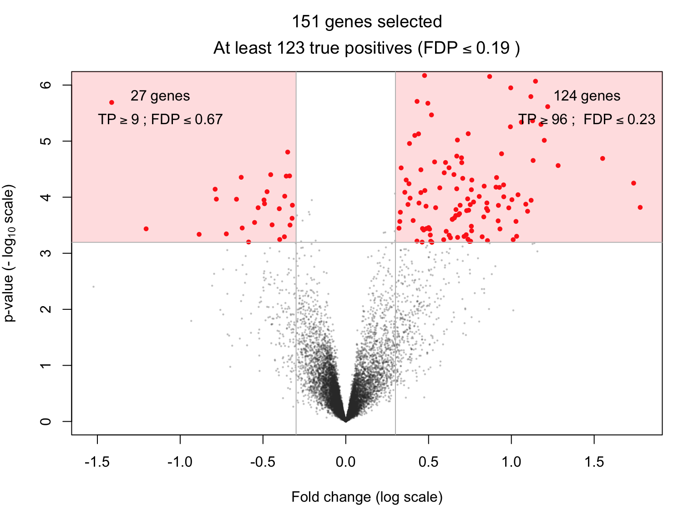

# sansSouci

<!-- badges: start -->
  [](https://github.com/pneuvial/sanssouci/actions)
[](https://codecov.io/github/pneuvial/sanssouci/branch/develop)
 <!-- badges: end -->
 
The goal of sansSouci is to perform *post hoc inference*: in a multiple testing context, sansSouci provides statistical guarantees on possibly user-defined and/or data-driven sets of hypotheses. 

# Installation

```r
# install.packages("remotes")
remotes::install_github("pneuvial/sanssouci@develop")
```

# Typical use cases in genomics and neuromaging

- Differential gene expression studies in genomics: see  [differential expression vignette](https://pneuvial.github.io/sanssouci/articles/post-hoc_differential-expression.html) and run [volcano plot shiny app](https://pneuvial.shinyapps.io/volcano-plot/)
- fMRI studies in neuroimaging: see [fMRI vignette](https://pneuvial.github.io/sanssouci/articles/post-hoc_fMRI.html). 

In both cases, permutation-based post hoc inference typically outperforms classical post hoc bounds based on probabilistic inequalities. The illustrations below are taken from the vignette [differential gene expression studies](https://pneuvial.github.io/sanssouci/articles/post-hoc_differential-expression.html).

## Confidence envelopes for "top-k" feature lists


## Volcano plots

Run [volcano plot shiny app](https://pneuvial.shinyapps.io/volcano-plot/)



This package is developed within the [SansSouci project](https://www.math.univ-toulouse.fr/~pneuvial/sanssouci).
