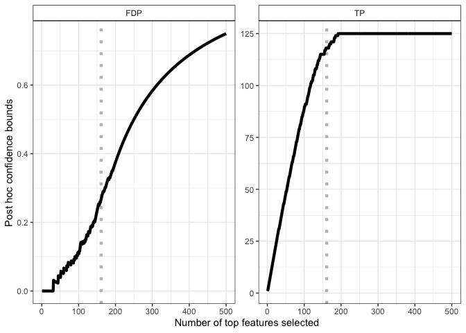

<!-- README.md is generated from README.Rmd. Please edit that file -->

# sanssouci

<!-- badges: start -->

[](https://github.com/pneuvial/sanssouci/actions)
[](https://codecov.io/github/pneuvial/sanssouci/branch/develop)
<!-- badges: end -->

The goal of sanssouci \[sãsusi\] is to perform **post hoc inference**:
in a multiple testing context, sanssouci provides statistical guarantees
on possibly user-defined and/or data-driven sets of hypotheses.

Typical use cases include:

  - **Differential gene expression (DGE) studies in genomics**:
      - see vignettes dedicated to [microarray
        data](https://pneuvial.github.io/sanssouci/articles/post-hoc_differential-expression.html)
        and [RNAseq
        data](https://pneuvial.github.io/sanssouci/articles/post-hoc_differential-expression_RNAseq.html)
      - run [volcano plot shiny
        app](https://shiny-iidea-sanssouci.apps.math.cnrs.fr/)
  - **fMRI studies in neuroimaging**: see [fMRI
    vignette](https://pneuvial.github.io/sanssouci/articles/post-hoc_fMRI.html).

In both cases, the permutation-based post hoc inference methods
implemented in the `sanssouci` package outperform classical post hoc
bounds based on probabilistic inequalities.

## Example: differential analysis

We briefly illustrate the case of differential gene expression study
(see dedicated
[vignette](https://pneuvial.github.io/sanssouci/articles/post-hoc_differential-expression.html)
for more information). We start by creating an object of class
`sanssouci` from gene expression data available from the
[sanssouci.data](https://github.com/pneuvial/sanssouci.data) package,

``` r
library("sanssouci")
#> remotes::install_github("pneuvial/sanssouci.data")
data(expr_ALL, package = "sanssouci.data")
groups <- ifelse(colnames(expr_ALL) == "BCR/ABL", 1, 0) # map to 0/1
obj <- SansSouci(Y = expr_ALL, groups = groups)
```

Then we fit the method by with `B=1000` permutations, and with a target
risk `alpha = 0.1`.

``` r
res <- fit(obj, alpha = 0.1, B = 1000)
```

### Output 1 - Post hoc bound for a subset of genes

Let us assume that we are interested in genes with a \(p\)-value below
\(10^{-3}\).

``` r
S <- which(pValues(res) < 1e-3)
#> Warning: namespace 'sansSouci' is not available and has been replaced
#> by .GlobalEnv when processing object '<unknown>'
predict(res, S)
#>          TP         FDP 
#> 114.0000000   0.2919255
```

The method ensures with \(1-\alpha = 90\%\) confidence that there are at
least 114 truly differentially expressed genes (true positives, TP)
among these 161 genes, corresponding to a false discovery proportion
(FDP) less than 0.3.

### Output 2 - Confidence curves for “top-k” feature lists

Another output of the method is the following \(1-\alpha\)-level
confidence curve on FDP (left panel) and corresponding TP (right panel)
in “top-k” gene lists.

``` r
library("ggplot2")
plot(res, xmax = 500) +
  geom_vline(xintercept = length(S), 
             color = "gray", linetype = "dotted", size = 1.5) +
  geom_line(size = 1.5)
```



### Output 3 - Volcano plots

A more refined user selection is obtained by selecting genes based on
both significance (here, a FDR-adjusted \(p\)-value below 0.05) and fold
change (here, fold change above 0.3). Such selections are generally
represented by volcano plots:

``` r
volcanoPlot(res, q = 0.05, r = 0.3, ylim = c(0, 6))
```


Importantly, multiple such selections can be made without compromising
the validity of the bounds. The [IIDEA shiny
app](https://shiny-iidea-sanssouci.apps.math.cnrs.fr/) makes it possible
to perform such selections interactively and without
programming.

## Installation

<!-- You can install the released version of sanssouci from [CRAN](https://CRAN.R-project.org) with: -->

<!-- ``` r -->

<!-- install.packages("sanssouci") -->

<!-- ``` -->

You can install the development version from
[GitHub](https://github.com/) with:

``` r
# install.packages("remotes")
remotes::install_github("pneuvial/sanssouci")
```
