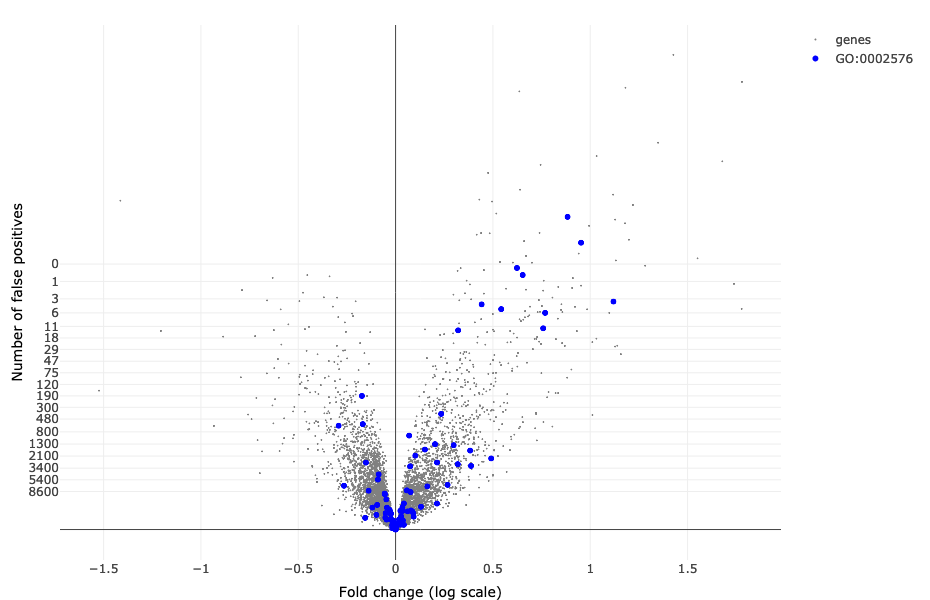

  
```{r setup, include = FALSE}
knitr::opts_chunk$set(
collapse = TRUE,
comment = "#>",
fig.width=8,
fig.height=6
)
```

# Introduction

This vignette provides guidelines for using the [IIDEA shiny application](https://shiny-iidea-sanssouci.apps.math.cnrs.fr). In the context of differential gene expression studies, this interactive application combines volcano plots with enrichment analyses. 

The main distinctive feature of this app is that it makes it possible for users to interactively select genes of interest (either from a volcano plot or corresponding to a particular gene set) and obtain valid statistical guarantees regarding the number of true/false positives among these genes (see Methods section below).

# Quick start

- Open the [IIDEA shiny application](https://shiny-iidea-sanssouci.apps.math.cnrs.fr/)
- Click on 'Run!'

- This launches the analysis of an example data set (described below): a volcano plot is displayed in the right panel, together with a table at the bottom of the left panel. 

```{r IIDEA_overview, out.width="600px", echo=FALSE}
knitr::include_graphics("img/IIDEA_overview.png")
```


# Interactive statistical guarantees

## Default output

```{r IIDEA_post-hoc-table, out.width="400px", echo=FALSE}
knitr::include_graphics("img/IIDEA_post-hoc-table.png")
```

The table displays, for each user selection of a set of genes, the following statistical guarantees:

- **TP$\geq$**: there are at least 57 truly differentially expressed genes (True Positives, TP) among the 70 genes selected in the volcano plot. 
- **FDP$\leq$**: the proportion of genes erroneously called differentially expressed among those selected (False Discovery Proportion, FDP) is less than 19%.


## User selections

- Select a set of genes of interest by dragging and dropping the horizonal and vertical bars, or by making a rectangular or a "lasso" selection. The table is updated with this selection. 
- Clicking on the line corresponding to a gene selection highlights the corresponding genes in the volcano plot.
- Clicking on the name of a gene selection in the table opens a new window with the corresponding set of genes displayed by [StringDB](https://string-db.org/).
- User selections and post hoc bounds can be downloaded as CSV files.

# Enrichment analyses

- Click on the 'Gene sets' tab in the left panel:  the table at the bottom of the left panel now displays statistical guarantees obtained by post hoc bounds for a list of GO terms (corresponding to the Biological Process ontology in the example below).
- Clicking on the line corresponding to GO a term highlights the corresponding genes in the volcano plot (see next Figure).
- Clicking on a GO term opens the associated QuickGO page (@binns2009quickgo), e.g. https://www.ebi.ac.uk/QuickGO/term/GO:0002576.
- Post hoc bounds can be downloaded as a CSV file. 

By default, all available gene sets are listed.  As noted by @ebrahimpoor2020simultaneous, post hoc inference makes it possible to perform enrichment analyses for both the "self-contained" and "competitive" hypotheses. Quoting @ebrahimpoor2020simultaneous:

- "Methods testing the competitive null test whether features in the feature set of interest are more often active than features outside the feature set.
-  Methods testing the self-contained null test whether there are any active features in the feature set of interest."

Both approaches are readily avialable via a drop-down menu, which makes it possible to filter only those gene sets that are significant according to the "self-contained" or "competitive" null hypotheses.

For example, in the Leukemia data set, the GO term Platelet degranulation (GO:0002576) is significant both for the competitive and the self-contained null hypotheses. This GO term is highlighted in the next plot, which has been obtained by clicking on the associated line in the gene set table.


```{r GO-plot, out.width="600px", echo=FALSE}

```


# Data

## Public data

### Leukemia data set

The first data set available in the list of public data sets is the Leukemia data set studied in @BGH2010.

```{r load-data, echo=FALSE}
data(expr_ALL, package = "sanssouci.data")
dat <- expr_ALL
rm(expr_ALL)
```

This data set consists of gene expression measurements for  $n = `r ncol(dat)`$ patients with B-cell acute lymphoblastic leukemia (ALL) @CLGV+2005. These patients are classified into two subgoups, depending on whether or not they harbor a specific mutation called "BCR/ABL". A Welch $T$test of equality of group mean expression is applied to each gene. 

This data set is available from the R package [`sanssouci.data`](https://github.com/sanssouci-org/sanssouci.data), and also studied in the [differential expression vignette](post-hoc_differential-expression.html) of the SansSouci package.

### GSEAbenchmarkeR data

Nine other data sets from  [`GSEABenchmarkeR`](https://bioconductor.org/packages/release/bioc/html/GSEABenchmarkeR.html) package are also available.  These  data sets contain gene expression measurements from microarray experiments for various diseases (several cancer types, Alzheimer’s disease). Each of these data sets can be choosen for analysis via 'Choose a gene data set' dropdown menu. 

Thanks to the Bioconductor package  [`EnrichmentBrowser`](https://bioconductor.org/packages/release/bioc/html/EnrichmentBrowser.html), an enrichement analysis of gene sets based on Gene Ontology gene sets (Biological Process) is available.

## User data

If "Use public data" is unchecked, users can upload their own gene expression data, and optionally a file containing gene sets of interest (for example obtained from Gene Ontology). 

### Gene expression

Gene expression data must be in of the two following formats (see also the example data files that can be downloaded from IIDEA):

- A matrix containing gene expression data, in the form of a gene $\times$ condition matrix. The first row of this matrix should be a header containing category labels 0 or 1. The first column contains an unique gene identifier per row. One current limitation of IIDEA in this case is that it performs Welch $T$ tests for differential expression, which is only suitable for microarray data;

- A matrix containing $p$-values and fold changes for each gene. This matrix can be obtained from any standard differential expression method (e.g. DESeq2, edgeR, limma-voom). 


Gene expression data must be stored in a csv file. the first row must contain the name of the columns. The separator should be a ','. Nevertheless, ';' and '\t' are allowed.

From a statistical perspective, an important limitation when only $p$-values and fold changes are provided is that post hoc inference can only be performed using the original post hoc bound of @GS2011, and not using the more powerful bounds of @blanchard20post-hoc. Indeed, the latter require the full expression matrix to be available in order to use permutations and obtain bounds that are adaptive to the dependence in the data set at hand.  An important perspective for IIDEA is to directly implement differential expression methods dedicated to count data, so that the powerful bounds of @blanchard20post-hoc can be used.

### Gene sets

Gene set information must be a CSV file where each row is a gene and each column is a gene set. It is a binary matrix specifying which gene is contained in each gene set. The first row must be a header containing the gene set names, and it must contain the same gene identifiers as the gene expression matrix.

While only the gene expression matrix is mandatory to obtain interactive volcano plots, uploading the gene set matrix is required for gene set analyses. Sample input data files can be downloaded as an example of the expected file structure. These files correspond to the public data set @CLGV+2005.

# Running the app on a local computer

IIDEA is deployed at \url{https://shiny-iidea-sanssouci.apps.math.cnrs.fr/}. No login is required, and the data sets uploaded by users are not stored on the server side. 
The source code of the R package \texttt{sanssouci} which contains the source files for IIDEA, is available at \url{https://github.com/sanssouci-org/sanssouci}. This allows users to run IIDEA on a local machine or deploy it on their own servers if desired. Once the 'remotes' package is installed, IIDEA can be run locally from an R session by executing the following commands:

```{r local, eval=FALSE}
remotes::install_github("sanssouci-org/sanssouci")
shiny::runApp(system.file("shiny-examples/volcano-plot", package = "sanssouci"))
```

By default, only the Leukemia data set is available for a local installation. To add the nine other public data sets, you may run the following code:

```{r local-add-GSEABenchmarkeR, eval=FALSE}
source(system.file("shiny-examples/volcano-plot/GSEABenchmarkeR/export-data.R", 
                   package = "sanssouci"))
```

This code uses functions of the [GSEABenchmarkeR](https://bioconductor.org/packages/release/bioc/html/GSEABenchmarkeR.html) package to normalize and store locally gene expression data sets and corresponding gene annotation from GO Biological Process. Please note that it may take several minutes to run (but it only needs to be run once).


# Methods

IIDEA leverages post hoc inference methods implemented in the R package  [`sanssouci`](https://github.com/sanssouci-org/sanssouci). 

Post hoc inference is a recent field stemming from the multiple testing literature where users are allowed to freely select hypotheses of interest after "seeing the data", without compromising statistical validity despite the issue of "cherry-picking" (@BNR:chap, @blanchard20post-hoc, @GS2011).

The methods implemented by IIDEA allow for valid inference without requiring assumptions on the dependence between genes. Instead, such dependencies are *estimated* from the data using permutation techniques, making our methods both mathematically valid and statistically powerful (see e.g. https://sanssouci-org.github.io/sanssouci/articles/post-hoc_differential-expression.html).

The parameters for this estimation step can be customized by clicking "Advanced parameters". 

# References


