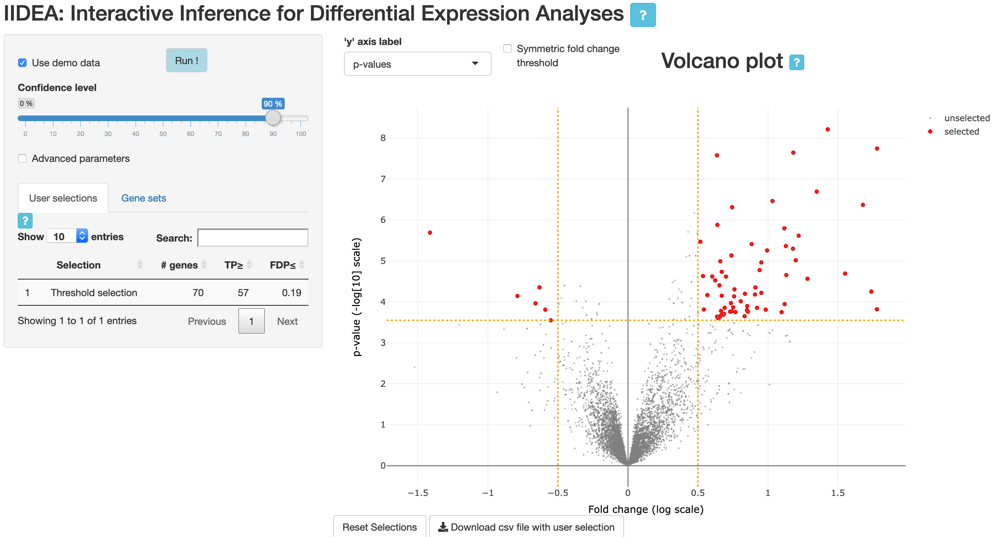

  
```{r setup, include = FALSE}
knitr::opts_chunk$set(
collapse = TRUE,
comment = "#>",
fig.width=8,
fig.height=6
)
```

# Introduction

This vignette provides guidelines for using the [IIDEA shiny application](https://pneuvial.shinyapps.io/volcano-plot/). In the context of differential gene expression studies, this interactive application combines volcano plots with enrichment analyses. 

The main distinctive feature of this app is that it makes it possible for users to interactively select genes of interest (either from the volcano plotor corresponding to a particular gene set) and obtain valid statistical guarantees regarding the number of true/false positives among these genes (see Methods section below).

# Quick start

- Open the [IIDEA shiny application](https://pneuvial.shinyapps.io/volcano-plot/)
- Click on 'Run!'

> This launches the analysis of an example data set (described below): a volcano plot is displayed in the right panel, together with a table at the bottom of the left panel. 

```{r IIDEA_overview, out.width="600px", echo=FALSE}

```


## Interactive statistical guarantees

### Default output

```{r IIDEA_post-hoc-table, out.width="400px", echo=FALSE}
knitr::include_graphics("img/IIDEA_post-hoc-table.png")
```


The table displays, for each user selection of a set of genes, the following statistical gaurantees:

- **TP$\geq$**: there are at least 57 truly differentially expressed genes (True Positives, TP) among the 70 genes selected in the volcano plot. 
- **FDP$\leq$**: the proportion of genes erroneously called differentially expressed among those selected (False Discovery Proportion, FDP) is less than 19%


### User selections

- Select a set of genes of interest by dragging and dropping the horizonal and vertical bars, or by making a rectangular or a "lasso" selection. 

> - The table is updated with this selection. 
> - Clicking on the line corresponding to a gene selection highlights the corresponding genes in the volcano plot
> - Clicking on the name of a gene selection in the table opens a new window with the corresponding set of genes displayed by [StringDB](https://string-db.org/)
> - User selections can be downloaded as a CSV file


## Gene sets 

- Click on the 'Gene sets' tab in the left panel. 

> The table at the bottom of the left panel now displays statistical guarantees obtained by post hoc bounds for a list of GO terms
> Clicking on a GO term highlights the corresponding genes in the volcano plot


# Data

## Example data

By default (i.e. when "Use demo data" is checked), we consider a data set studied in @BGH2010.

```{r load-data, echo=FALSE}
data(expr_ALL, package = "sansSouci.data")
dat <- expr_ALL
rm(expr_ALL)
```

This data set consists of gene expression measurements for  $n = `r ncol(dat)`$ patients with B-cell acute lymphoblastic leukemia (ALL) @CLGV+2005. These patients are classified into two subgoups, depending on whether or not they harbor a specific mutation called "BCR/ABL". In this example, differential expression is applied by performing a statistical test of equality of means to each gene. 

This data set is available from the R package [`sansSouci.data`](https://github.com/pneuvial/sanssouci.data).

## User data

- Uncheck "Use demo data": you will be able to upload your own gene expression data, and optionally a file containing gene sets of interest (for example obtained from Gene Ontology). The file format is described in the app, and example data files are also provided. 


# Methods

IIDEA leverages post hoc inference methods implemented in the R package  [`sansSouci`](https://github.com/pneuvial/sanssouci). 

Post hoc inference is a recent field stemming from the multiple testing literature where users are allowed to freely select hypotheses of interest after "seeing the data", without compromising statistical validity despite the issue of "cherry-picking" (@BNR:chap, @blanchard20post-hoc, @GS2011).

The methods implemented by IIDEA allow for valid inference without requiring assumptions on the dependence between genes. Instead, such dependencies are *estimated* from the data using permutation techniques, making our methods both mathematically valid and statistically powerful (see e.g. https://pneuvial.github.io/sanssouci/articles/post-hoc_differential-expression.html).

The parameters for this estimation step can be customized by clicking "Advanced parameters". 

# References


